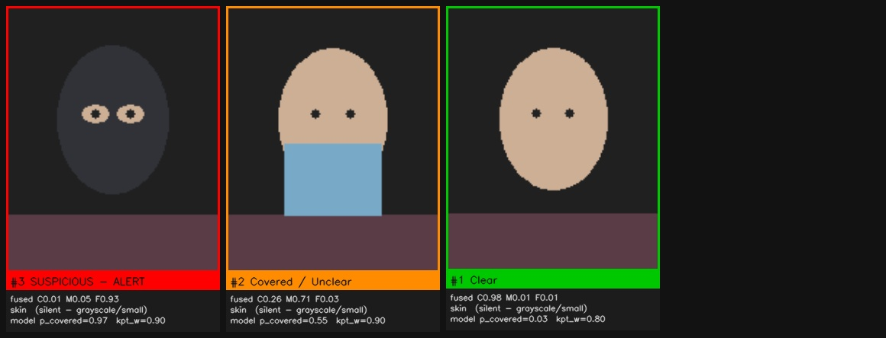
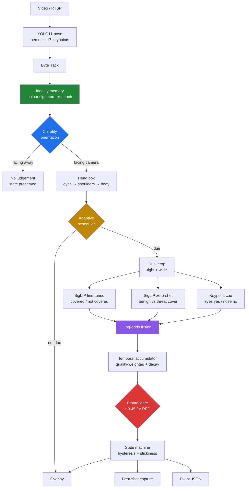
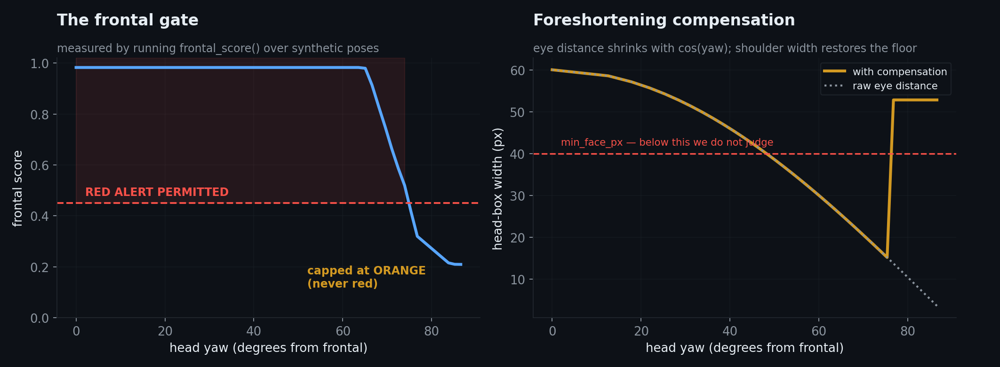
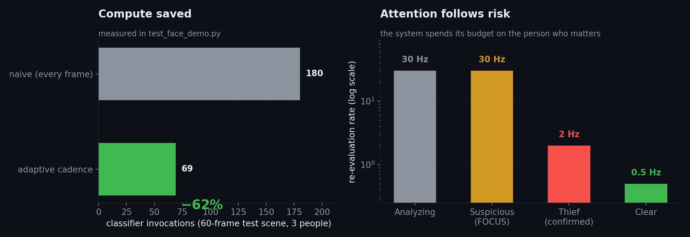
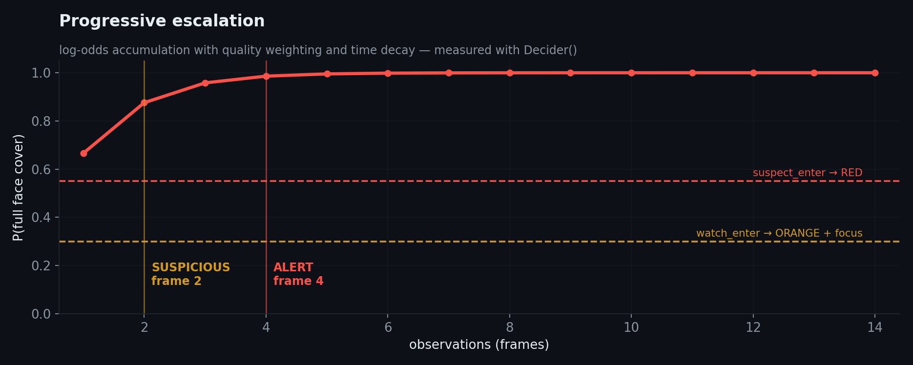
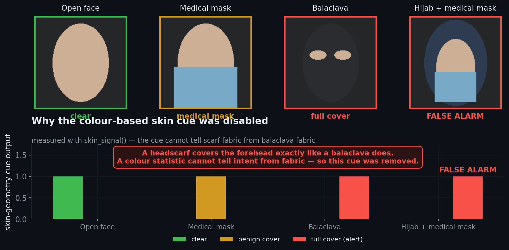
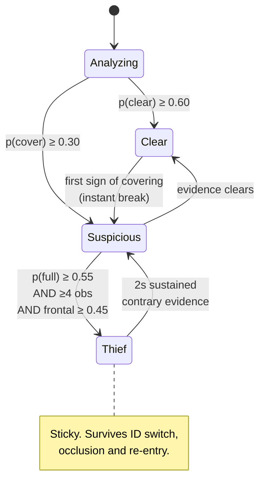

<div align="center">

# Concealed-Face Detection for Retail Security

**Telling a robber in a balaclava from a customer in a surgical mask — in real time, on one GPU.**

[](https://python.org)
[](https://pytorch.org)
[](https://docs.ultralytics.com)
[](https://colab.research.google.com)
[](#test-suite)
[](#models)

</div>

---

## The problem nobody actually solved

Every "face mask detector" on GitHub answers the wrong question.

They tell you **"is this person wearing a mask?"** — a binary that was useful in 2020 and
is useless for security. In a shop, a mask means nothing. What matters is:

> **Is this person's identity recoverable if something happens?**

A surgical mask leaves the eyes, eyebrows, forehead and hairline visible. A balaclava does
not. Those two cases sit in the *same class* for every off-the-shelf mask model — and
they are the only two cases a security system cares about telling apart.

This project answers the security question, using **only pre-trained models**. There is no
dataset to collect and no training step. You point it at a video and it runs.

<div align="center">

<br><sub><b>The judgement sheet</b> — every subject, ranked by severity, with the reasoning printed underneath.
Built so a human can audit the system in one glance instead of trusting it blindly.</sub>
</div>

---

## Table of contents

- [What makes this different](#what-makes-this-different)
- [Architecture](#architecture)
- [The five ideas](#the-five-ideas)
  - [1. Chirality — orientation from anatomy](#1-chirality--orientation-from-anatomy)
  - [2. The frontal gate — a hard-won lesson](#2-the-frontal-gate--a-hard-won-lesson)
  - [3. Attention follows risk](#3-attention-follows-risk)
  - [4. Evidence, not decisions](#4-evidence-not-decisions)
  - [5. Two crops, two purposes](#5-two-crops-two-purposes)
- [Cultural safety — the hijab problem](#cultural-safety--the-hijab-problem)
- [Models](#models)
- [Decision states](#decision-states)
- [Results](#results)
- [Quick start](#quick-start)
- [Configuration](#configuration)
- [Engineering log](#engineering-log)
- [Test suite](#test-suite)
- [Roadmap](#roadmap)

---

## What makes this different

| | Typical mask detector | **This project** |
|---|---|---|
| Question asked | *Is there a mask?* | *Is the identity recoverable?* |
| Medical mask vs balaclava | same class | **separated** |
| Head orientation | ignored | geometric, face-independent |
| Person facing away | judged anyway | **never judged** |
| Profile / half-face | judged anyway | **capped at "unclear", never alarms** |
| Headscarf / hijab | frequent false alarm | **explicitly modelled as benign** |
| Decision basis | one frame | evidence accumulated over time |
| Compute | every person, every frame | **budget follows risk (−62%)** |
| Auditability | a coloured box | crop + reason + confidence per subject |
| Training required | dataset + GPU-days | **none** |

---

## Architecture



Everything in blue/red/purple/orange/green is an idea this project contributes. The rest is
plumbing around off-the-shelf models.

---

## The five ideas

### 1. Chirality — orientation from anatomy

COCO keypoints carry a property almost nobody exploits: they are labelled **anatomically**.
Index 5 is *the person's own left shoulder*, not "the shoulder on the left of the image".

So when a person turns around, the labels **cross over in image space**:

<div align="center"></div>

```
sign( x(left_shoulder) − x(right_shoulder) )   →   facing camera or facing away
```

Three independent chirality votes are fused — shoulders, ears, eyes — each weighted by
keypoint confidence **and** by foreshortening (when a pair collapses toward each other, the
sign becomes noise, so its vote is down-weighted automatically).

**Why this matters more than it looks.** The signal never touches the face. It works on a
person wearing a full balaclava — exactly the case where every face-based heuristic fails.
That is what lets us skip people facing away *without* also skipping the masked robber.

Cost: a handful of arithmetic operations on keypoints we already have. Effectively free.

---

### 2. The frontal gate — a hard-won lesson

The first prototype of this project used a hard gate: *"only analyse when eyes and nose are
confidently visible."* It produced very few false alarms.

I removed it, reasoning that a masked robber has no visible eyes or nose either — so the
gate would silently skip the exact person we want to catch. That reasoning was correct.
**The replacement was not.** With no gate, profile views started firing alarms.

Measuring the failure showed why:

| Head yaw | Eye-box width | What the crop actually contained |
|---|---|---|
| frontal | 60 px | the face |
| 45° | 27 px | face + some hair |
| 55° | **21 px** | mostly hair and background |

Eye distance shrinks with `cos(yaw)`, so the head box collapses and slides off the face.
The cues then confidently describe hair as "covering".

**The fix is a synthesis, not a rollback.** The gate is applied to the *verdict*, not to
*looking*:

- Everyone is analysed, and anyone can be flagged **orange**.
- A **red alarm** additionally requires `frontal_score ≥ 0.45`.

<div align="center"></div>

`frontal_score` multiplies two independent estimates:

- **Eye symmetry** — the *minimum* of the two eye confidences, never the mean. A mean is
  easy to fool: 0.9 and 0.1 averages to a respectable 0.5, while the minimum correctly
  reports 0.1.
- **Chirality confidence** — from idea 1, which survives occlusion.

Plus a foreshortening floor on the head box: `d = max(eye_distance, 0.135 × shoulder_width)`.

Net effect: a masked person facing the camera still alarms. A profile view never does — it
waits, orange, until they turn.

---

### 3. Attention follows risk

Running the classifier on everyone, every frame, is the whole cost of the system — and most
of it is wasted on people who were resolved seconds ago.

<div align="center"></div>

| State | Re-evaluation rate | Reasoning |
|---|---|---|
| Analyzing | every frame | a verdict is needed fast |
| **Suspicious** | **every frame — focus** | this is the person who matters |
| Thief (confirmed) | every 0.5 s | monitoring only |
| Clear | every 2 s | cheap — but never *never* |

That last row is a security property, not an optimisation. The first prototype locked a
"clear" verdict **permanently**, which means a thief could walk in bare-faced, get a green
lock, then pull a balaclava on and never be looked at again. Here green is sticky but
breakable, and it breaks on the *first* sign of covering.

Measured on the test scene: **180 → 69 classifier invocations, a 62% reduction**, with no
loss of verdict quality.

---

### 4. Evidence, not decisions

Modules never decide. They emit **evidence** against a persistent identity, and a separate
layer turns accumulated evidence into a verdict.

```
score[c] ← score[c] · decay^Δt  +  w · log p(c)        w = size × sharpness × ROI reliability
posterior = softmax(score)
```

Log-odds rather than averaging, because two *independent* cues agreeing should make us more
confident than either alone — averaging dilutes exactly when it should reinforce.

<div align="center"></div>

Properties that fall out of the formula for free:

- A blurry 20-pixel crop contributes little without needing a rejection rule.
- Evidence fades, so no verdict is permanent.
- Hysteresis: entering red is hard, leaving is easier — no flicker for the operator.
- **Stickiness**: once red, 2 continuous seconds of contrary evidence are required to
  clear it. One bad frame cannot exonerate a suspect.
- Adding weapon, fire or behaviour modules later is one line each — they write evidence to
  the same identity. This is why the architecture is worth the extra layer.

---

### 5. Two crops, two purposes

A genuine conflict: the classifier wants a **tight** crop where the face fills the frame,
while a human auditor wants a **wide** crop with enough context to judge whether the system
was right.

Rather than compromise, both are produced from the same clean frame:

| Crop | Consumer | Geometry |
|---|---|---|
| Tight | the models | `3.0 × eye_distance`, roll-corrected |
| Wide | you | `2.1 ×` the tight box, unrotated |

Two details that matter more than they sound:

- **Crops come from a pristine frame**, never from the annotated one. The first prototype
  cropped after drawing, so every saved face had a coloured rectangle and skeleton lines
  across it — useless as evidence and worthless as future training data.
- **Best-shot, not first-shot.** The highest-quality view of each subject is kept, not the
  moment they entered the scene (which is invariably the blurriest and most distant).

---

## Cultural safety — the hijab problem

This system is built for deployment in Iran. That constraint killed a feature.

An early discriminator used **skin geometry**: measure visible skin on the forehead versus
the lower face. It is elegant, cheap, and works on the synthetic cases:

```
forehead skin + lower skin   →  open face
forehead skin + lower cloth  →  medical mask
forehead cloth + lower cloth →  full cover  ← alarm
```

Then I tested a woman wearing a headscarf and a surgical mask:

<div align="center"></div>

**Verdict: "thief", confidence 1.00.**

A headscarf covers the forehead exactly like a balaclava does. A colour statistic has no
access to intent, and no amount of threshold tuning fixes a cue that is measuring the wrong
thing. In Iran this is not a tuning issue — it is a system that alarms on a large fraction
of the population.

**The cue was removed from the decision path** (`w_skin = 0.0`). It is still computed and
printed on the judgement card, because seeing what the system sees is useful. It simply
does not vote.

Discrimination of covering *type* moved to the zero-shot model, which understands
**meaning** rather than pixel statistics — and gained an explicit benign class:

| Group | Prompts |
|---|---|
| `BENIGN` | surgical mask, N95, **headscarf, hijab, chador**, hood, winter scarf |
| `THREAT` | balaclava, ski mask, fully wrapped face, full-face helmet with visor down |

A model trained on hundreds of millions of image–text pairs knows that "a woman in a hijab
wearing a surgical mask" and "a robber in a balaclava" are different concepts. A histogram
never will.

> **The general lesson:** a hand-crafted cue that correlates with the target in your test
> images can correlate with something else entirely in your deployment population. Test on
> the population you will actually deploy to, and be willing to delete your clever feature.

---

## Models

All pre-trained. **Nothing is trained here.**

| Role | Model | Why this one |
|---|---|---|
| Person + pose + tracking | `yolo11n-pose` | one forward pass gives boxes, 17 keypoints and tracking; `yolo11s-pose` for distant subjects |
| Covered / not covered | `prithivMLmods/Face-Mask-Detection` (SigLIP, fine-tuned) | **the backbone of the verdict** — a model fine-tuned on the exact task beats zero-shot on low-resolution CCTV crops, decisively |
| Covering type | `google/siglip-base-patch16-224` (zero-shot) | the only component that can separate hijab from balaclava; used **only** for a binary contrast, never a 5-way choice |

### A design note earned the hard way

An earlier iteration replaced the fine-tuned model with pure zero-shot across five classes.
Accuracy collapsed. Two reasons, both instructive:

1. **Fine-tuned beats zero-shot on-distribution.** The fine-tuned model saw this task; the
   zero-shot model has to infer it from text.
2. **Zero-shot is far more reliable at binary contrasts than at n-way choices.** Forced to
   pick one of five classes — including a class described as *"a blurry, unrecognisable,
   low-resolution image"* — it picked that one almost every time, because that prompt
   describes the imaging conditions of literally every CCTV crop.

So the question is **decomposed**, and each half goes to the model that is strong at it:

```
"Is the face covered?"      → fine-tuned model   (accurate, stable, cheap)
"What kind of covering?"    → zero-shot, binary  (semantic, hijab-aware)
```

The zero-shot model only runs on crops the first model already flagged as covered — in an
ordinary scene, near-zero added cost.

> **Prompt-engineering lesson:** classes must be separated by *what is in the image*, never
> by *how good the image is*. Quality belongs in the quality layer.

---

## Decision states



| State | Colour | Meaning |
|---|---|---|
| Analyzing | ⬜ grey | gathering evidence |
| Clear | 🟩 green | face open and identifiable |
| Covered / Unclear | 🟧 orange | benign covering, profile, or facing away |
| **SUSPICIOUS — ALERT** | 🟥 **red** | **face fully concealed** |

Box, skeleton and label all share the state colour, so the frame reads at a glance.

---

## Results

> **Read this honestly.** Every number below is measured by running the real code, but
> against **synthetic scenes with mock models**. They validate *logic* — geometry,
> escalation, gating, tracking, scheduling. They are **not** accuracy figures on real
> footage. Real-world precision/recall requires labelled video and is the next milestone.

| Property | Measured | How |
|---|---|---|
| Time to "suspicious" | **2 frames** | `Decider` escalation |
| Time to "alert" | **4 frames** | `Decider` escalation |
| Compute saved | **−62%** (180 → 69 calls) | adaptive cadence vs naive |
| Profile false alarm | **eliminated** | red blocked below `frontal_score` 0.45 |
| Hijab + mask false alarm | **eliminated** | skin cue removed from decision path |
| Head-box area error | **2.09× → 1.25×** | scale-consistent candidate fusion |
| Identity across ID switch | **preserved** | colour-signature re-attach |
| Facing away | **0 observations, 0 alarms** | chirality gate |

---

## Quick start

### Colab (recommended)

Open `Face_Mask_Demo.ipynb`, set `Runtime → GPU`, point it at a video, run top to bottom.
Everything is self-contained — no repository install, no weights to download by hand.

```python
cfg = Cfg(
    video      = "/content/drive/MyDrive/your_video.mp4",
    max_frames = 400,        # 0 = whole video; keep it small on the first run
)
summary, dec, panels = run(cfg)
```

Outputs land in `runs/`:

| File | Contents |
|---|---|
| `demo.mp4` | annotated video |
| `demo_crops/_contact_sheet.jpg` | **the judgement sheet** |
| `demo_crops/id###_*.jpg` | best-shot per subject, clean and annotated |
| `demo_crops/summary.json` | every event with the reasoning behind it |

### Local

```bash
pip install ultralytics transformers torch opencv-python
python -c "from face_demo import Cfg, run; run(Cfg(video='input.mp4'))"
python test_face_demo.py          # 8/8 should pass
python make_figures.py            # regenerate every figure in this README
```

---

## Configuration

Everything tunable lives in one dataclass. The three that matter:

```python
cfg.red_min_frontal = 0.45   # ↓ catches more angles, ↑ fewer profile false alarms
cfg.suspect_enter   = 0.55   # red threshold
cfg.min_face_px     = 40     # below this, no judgement at all
```

| Symptom | Try |
|---|---|
| Missing masked people in the distance | `imgsz = 960`, `min_face_px = 28` |
| Robbery masks stay orange | `red_min_frontal = 0.35` |
| False alarms | `suspect_enter = 0.65`, `confirm_votes = 6` |
| Everyone reads as "facing away" | `back_threshold = -0.45` |
| Too slow | `imgsz = 512`, `cadence_clear_s = 4.0` |

The judgement sheet tells you which one you need — it prints the reasoning per subject.

---

## Engineering log

Real bugs found by measuring rather than guessing. Kept here because the failures are more
instructive than the successes.

| # | Bug | Impact | Root cause |
|---|---|---|---|
| 1 | Face crop rotated 180° | classifier saw upside-down hair | `atan2` on anatomical eye order — for a frontal face the vector points backwards |
| 2 | Keypoint gate rejected masked people | the target case was silently skipped | gate conflated "no face visible" with "not worth looking at" |
| 3 | Label map hard-coded | whole system could invert silently | `{0:"mask", 1:"no_mask"}` instead of reading `config.id2label` |
| 4 | Windows path without raw string | video never opened | `"C:\1\..."` — `\1` is a control character |
| 5 | Crops taken from annotated frame | evidence images unusable | cropped after drawing |
| 6 | Permanent green lock | thief could mask up after clearing | state locked forever |
| 7 | Head box 2.09× too large | face filled 31% of the classifier input instead of 64% | averaged eye-derived and shoulder-derived boxes across incompatible scales |
| 8 | `UNKNOWN` prompt described CCTV itself | zero-shot picked it every time → **zero alarms** | *"a blurry, unrecognisable, low-resolution image"* |
| 9 | `UNKNOWN`/`BACK_HEAD` diluted the posterior | red threshold mathematically unreachable | non-informative classes competing in the same softmax |
| 10 | Stale `build_classifier` in the notebook | the fine-tuned model never loaded at all | notebook edited by hand instead of regenerated from source |
| 11 | Profile views alarmed | false positives | head box collapses with `cos(yaw)` and lands on hair |
| 12 | **Hijab + mask → "thief" @ 1.00** | unusable in the target market | skin cue cannot distinguish scarf fabric from balaclava fabric |

---

## Test suite

`python test_face_demo.py` — mock pose model and mock classifiers, so the *logic* is tested
without a GPU or network.

| Test | Checks |
|---|---|
| Verdicts | three known subjects → clear / suspicious / thief |
| Compute budget | adaptive cadence really skips work |
| Latency | suspicious ≤ 3 frames, alert ≤ 5 frames |
| **Frontal gate** | frontal and 45° may alarm; profile may not |
| Stickiness | red survives 0.4 s of contrary evidence, breaks after 3 s |
| Identity memory | verdict survives a tracker ID switch |
| Facing away | zero observations, zero alarms |
| Outputs | video, judgement sheet and JSON all written |

---

## Roadmap

**Now** — validate on real footage; tune `red_min_frontal` against measured precision/recall.

**Next: distillation.** Every saved crop is training data. The zero-shot model becomes an
offline *teacher* that auto-labels them; the knowledge is distilled into a ~4M-parameter
student. Roughly 50× smaller than the current classifier — and typically *more* accurate,
because it is trained on your cameras, your lighting, your population.

```
run normally → harvest crops → auto-label → distil → better model → better crops → ↺
```

**Then: shared-backbone multi-task.** Instead of re-encoding each face crop, RoIAlign the
head box directly on YOLO's existing feature map and attach a lightweight head. Classifier
cost drops from linear in the number of people to effectively constant.

**Then: additional evidence modules** — weapon detection at the wrists, fire, behaviour.
Each is one line into the fusion layer, because they all write evidence to the same
identity. That is what the architecture was built for.

---

<div align="center">
<sub>Built for retail security in Iran. Pre-trained models only — no training step, no dataset collection.</sub>
</div>
