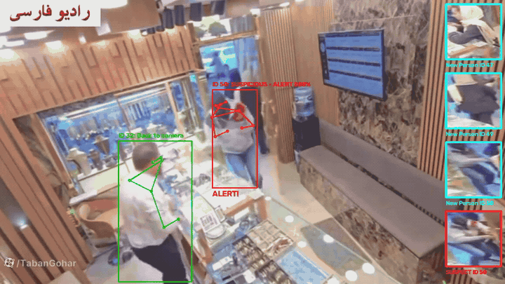
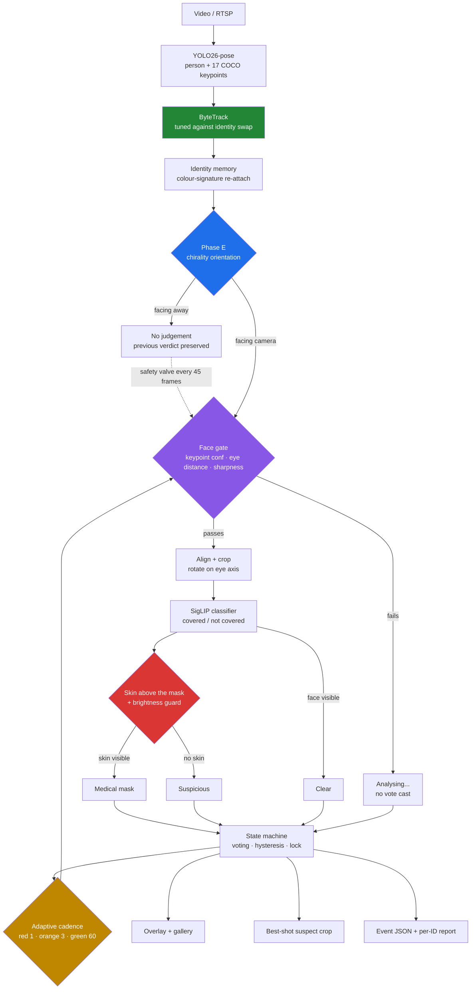
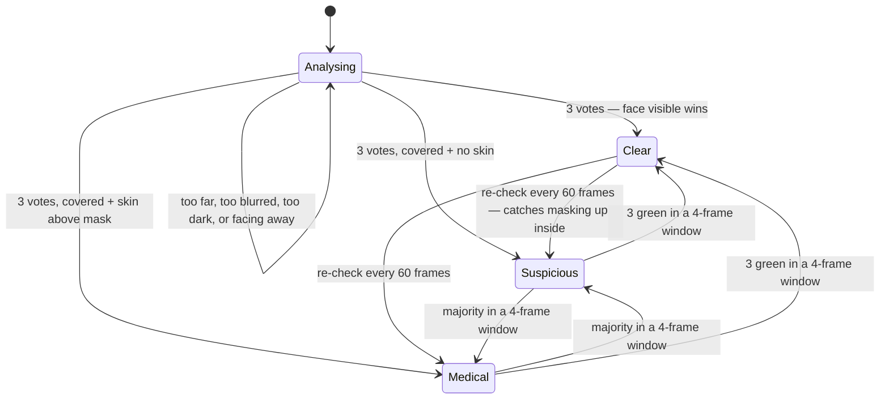
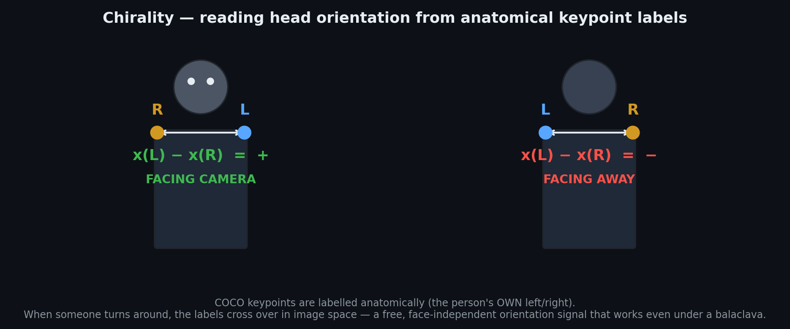
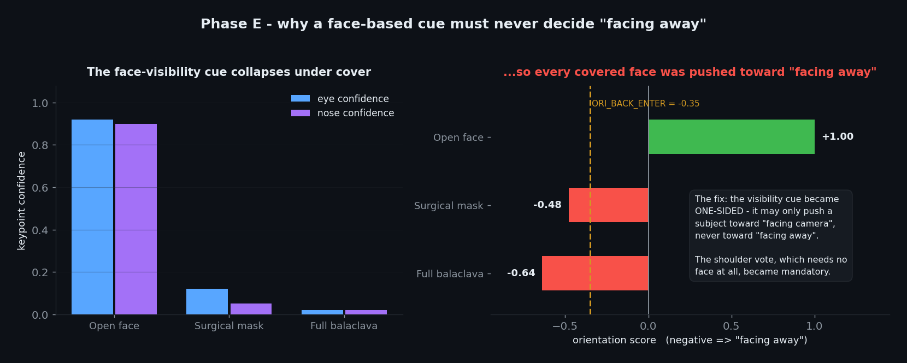
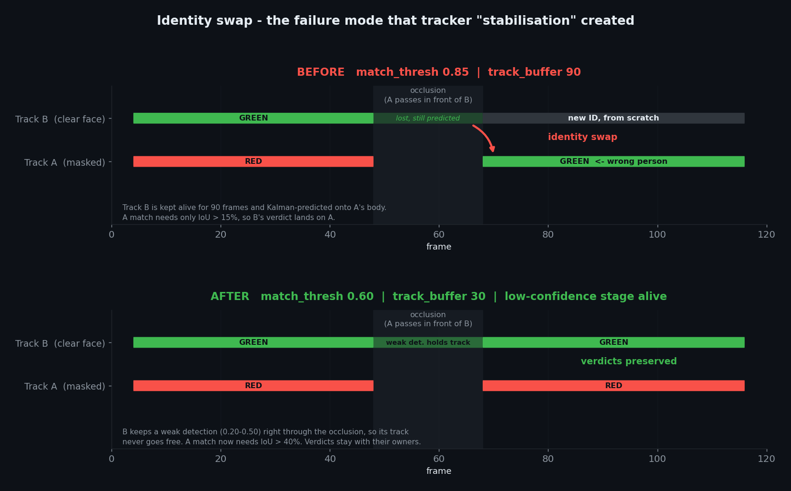
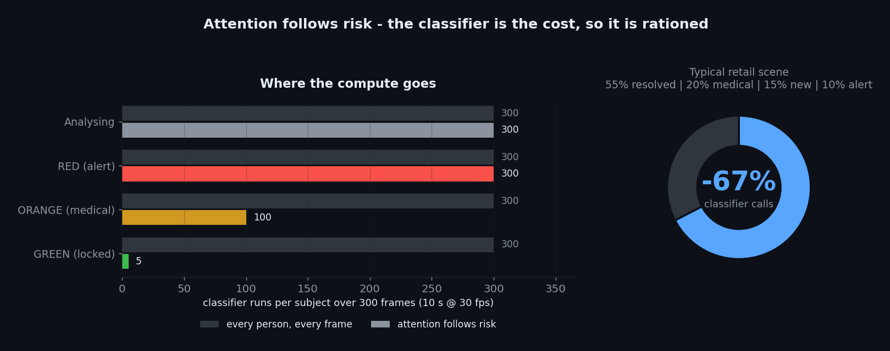
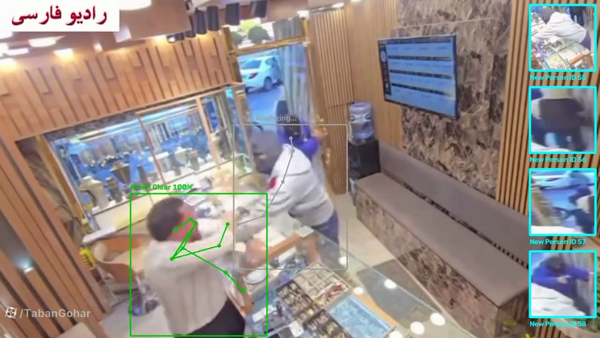
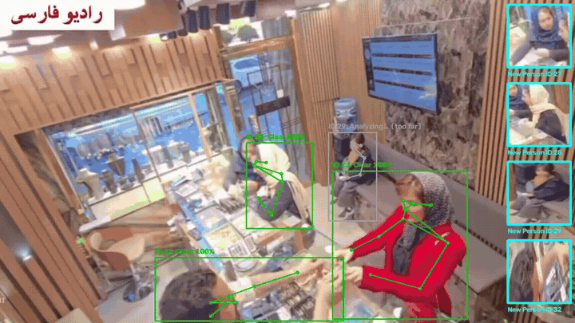

<div align="center">

# Concealed-Face Detection for Retail Security

**Telling a robber in a balaclava from a customer in a surgical mask — in real time, from ordinary CCTV.**

[](https://python.org)
[](https://pytorch.org)
[](https://docs.ultralytics.com)
[](#the-identity-swap-and-why-stabilising-a-tracker-made-it-worse)
[](https://colab.research.google.com)
[](#models)
[](#stage-1-demo--and-what-lives-behind-it)



<sub><b>Real CCTV, unmodified.</b> The shop owner on the left is cleared in green while facing away from the camera —
his verdict is held, not re-litigated. The masked subject on the right is flagged red with the reason and confidence
printed on the box. The strip on the right is the live review gallery.</sub>

</div>

---

## Table of contents

- [The question this asks](#the-question-this-asks)
- [What makes this different](#what-makes-this-different)
- [Architecture](#architecture)
- [Decision states](#decision-states)
- [The five ideas](#the-five-ideas)
  - [1. Chirality — orientation from anatomy](#1-chirality--orientation-from-anatomy)
  - [2. The identity swap — and why "stabilising" a tracker made it worse](#the-identity-swap-and-why-stabilising-a-tracker-made-it-worse)
  - [3. Attention follows risk](#3-attention-follows-risk)
  - [4. Skin above the mask](#4-skin-above-the-mask)
  - [5. Identity memory that never inherits a lock](#5-identity-memory-that-never-inherits-a-lock)
- [Built for bad footage](#built-for-bad-footage)
- [Cultural safety — the headscarf case](#cultural-safety--the-headscarf-case)
- [Models](#models)
- [Results](#results)
- [Quick start](#quick-start)
- [Capturing suspect crops](#capturing-suspect-crops)
- [Configuration](#configuration)
- [Repository layout](#repository-layout)
- [Engineering log](#engineering-log)
- [Stage 1 demo — and what lives behind it](#stage-1-demo--and-what-lives-behind-it)
- [Collaboration](#collaboration)

---

## The question this asks

Every "face mask detector" on GitHub answers the wrong question.

They tell you **"is this person wearing a mask?"** — a binary that was useful in 2020 and is
useless for security. In a shop, a mask means nothing on its own. What actually matters is:

> **If something happens in the next thirty seconds, is this person's identity recoverable?**

A surgical mask leaves the eyes, eyebrows, forehead and hairline visible. A balaclava does
not. Those two cases fall in the **same class** for every off-the-shelf mask model — and they
are precisely the two cases a security system exists to tell apart.

This project answers the security question using **only pre-trained models**. There is no
dataset to collect and no training step. You point it at a video and it runs.

---

## What makes this different

| | Typical mask detector | **This project** |
|---|---|---|
| Question asked | *Is there a mask?* | *Is the identity recoverable?* |
| Medical mask vs balaclava | same class | **separated** |
| Head orientation | ignored | geometric, **face-independent** |
| Person facing away | judged anyway | **never judged, verdict preserved** |
| Subject too far / too blurred | judged anyway | **held at "Analysing", never alarms** |
| Headscarf / hijab | frequent false alarm | **cleared, by design** |
| Decision basis | one frame | votes accumulated over time, with hysteresis |
| Occlusion between people | verdicts leak across identities | **hardened against identity swap** |
| Compute | every person, every frame | **budget follows risk** |
| Auditability | a coloured box | crop + confidence + per-ID timeline + event JSON |
| Training required | dataset + GPU-days | **none** |

---

## Architecture



Everything in colour is a decision this project contributes. The rest is plumbing around
off-the-shelf models.

---

## Decision states

Four states, and the rules for moving between them. The design bias is explicit: **when the
system is unsure, it says so rather than guessing.**



| State | Overlay | Meaning | What triggers it |
|---|---|---|---|
| ⬜ **Analysing** | grey | *No opinion yet.* | New track, or every gate failed: eye distance < 8 px, Laplacian sharpness < 19, keypoint confidence < 0.5, or the subject is facing away |
| 🟩 **Clear** | green | Identity is recoverable. | Classifier says the face is visible, 3 accumulated votes. **Locked**, but re-checked every 60 frames |
| 🟧 **Medical** | orange | Covered, but benignly. | Classifier says covered **and** skin is visible above the covering |
| 🟥 **Suspicious** | red | Identity is not recoverable. | Classifier says covered **and** no skin above it **and** the region is bright enough to trust the measurement |

Two rules make this usable in a real shop rather than in a demo:

- **A green lock is never permanent.** Someone can walk in with an open face, get cleared,
  then pull a mask up in aisle three. Every locked subject is re-examined every 60 frames
  (≈2 s). Cost: about 1.7% of a naive full-rate check.
- **Red never fires on a dark measurement.** The skin test is a colour test, and colour is
  meaningless below a brightness floor. Under it, the verdict is capped at orange. A shadow
  is not evidence.

---

## The five ideas

### 1. Chirality — orientation from anatomy

COCO keypoints carry a property almost nobody exploits: they are labelled **anatomically**.
Index 5 is *the person's own left shoulder*, not "the shoulder on the left of the image".

So when a person turns around, the labels **cross over in image space**:

<div align="center"></div>

```
sign( x(left_shoulder) − x(right_shoulder) )   →   facing camera, or facing away
```

**Why this matters more than it looks.** The signal never touches the face. It works on a
person wearing a full balaclava — exactly the case where every face-based heuristic fails.
That is what lets the system skip people facing away *without* also skipping the masked
subject we exist to catch.

#### The bug this created, and the five hardenings

The first version of Phase E also used a "face visibility" cue: if eyes and nose are
confidently detected, the person is probably facing the camera. Reasonable. It was wrong.

<div align="center"></div>

Every covered face has low eye and nose confidence — so the cue silently pushed **every
masked person** toward "facing away", where they would never be judged. The exact subject
the system is built to catch could hide from it by being covered.

Five hardenings, all still face-independent:

| | Hardening |
|---|---|
| **H1** | The visibility cue became **one-sided** — it may only push a subject toward *facing camera*, never toward *facing away* |
| **H2** | The shoulder vote, which needs no face at all, became **mandatory** |
| **H3** | "Facing away" requires either two agreeing cues or a decisive shoulder sign |
| **H4** | Hysteresis: enter at −0.35, leave at −0.20, so the state cannot flicker |
| **H5** | **Safety valve** — even a subject held as "facing away" is force-checked every 45 frames, so a persistent error can never hide anyone indefinitely |

Cost measured at **29 µs per person** — for five people, 0.14 ms, about 0.3% of one frame's
budget. Net effect on runtime is *negative*, because the classifier is skipped entirely for
anyone facing away.

---

### The identity swap — and why "stabilising" a tracker made it worse

This is the most instructive failure in the project, and it is worth reading even if you
never run the code.

**The symptom.** A flagged subject walks in front of a cleared subject. The cleared subject
is occluded for a second. When the scene clears, the *green verdict is sitting on the masked
person*. Two identities had merged.

**The cause was a well-intentioned optimisation.** An earlier version tried to make track IDs
more stable by raising `track_buffer` 30 → 90 and `match_thresh` 0.80 → 0.85. Both changes
sound like they tighten the tracker. Both do the opposite:

<div align="center"></div>

- `match_thresh` in ByteTrack is a threshold on **IoU distance**, not on similarity. A match
  is accepted when `1 − IoU < match_thresh`. Raising it to 0.85 means **IoU above 15% is
  enough** — and two people mid-crossing overlap far more than that. The "tightening" was
  actually a loosening, and looser than the stock default.
- `track_buffer` 90 keeps a lost track alive for three seconds while Kalman **keeps
  predicting its box forward**. That ghost box drifts straight onto the neighbour and waits
  there to absorb the first detection it can reach.
- Worse, `conf_thres` (0.40) sat *above* `track_low_thresh` (0.10), so the low-confidence
  detections were filtered out before the tracker ever saw them. **ByteTrack's second
  association stage — the entire point of the algorithm — was dead.**

**The fix runs in the opposite direction to the intuition:**

| Parameter | "Stabilised" | **Final** | Why |
|---|---|---|---|
| `match_thresh` | 0.85 | **0.60** | A match now requires IoU > 40% |
| `track_buffer` | 90 | **30** | A ghost track has one second, not three, to drift |
| `new_track_thresh` | 0.60 | **0.50** | A half-occluded subject re-emerging may claim its own ID again |
| `conf_thres` | 0.40 | **0.20** | Weak detections reach the tracker |
| `track_low_thresh` | 0.10 | **0.20** | ...and are used by the second association stage |

The real mechanism for stability was never a longer buffer. It was **reviving ByteTrack's
low-confidence stage**: a subject walking behind someone keeps a weak detection throughout
the occlusion, so their track never goes free, so there is nothing for a neighbour to steal.

> **The general lesson.** "Stable IDs" and "identities never mix" are *opposing* objectives.
> A long buffer and permissive matching buy the first at the cost of the second. For a
> security system that trade is backwards: a subject picking up a new ID is a cosmetic
> annoyance; a verdict landing on the wrong person is a false accusation. This build
> deliberately sacrifices the first for the second.

`conf_thres` and `track_low_thresh` **must stay equal**. If they drift apart, the second
stage switches off silently and this whole class of bug returns with no error message.

---

### 3. Attention follows risk

Running the classifier on everyone, every frame, is essentially the entire cost of the
system — and most of it is spent re-confirming people who were resolved seconds ago.

<div align="center"></div>

| State | Re-check cadence | Reasoning |
|---|---|---|
| Analysing | every frame | Needs to reach a verdict fast |
| 🟥 Suspicious | every frame | The most important subject in the scene |
| 🟧 Medical | every 3 frames | Common and stable; re-checking it constantly is wasted budget |
| 🟩 Clear (locked) | every 60 frames | Only needs to catch someone covering up later |

An earlier version used "every 2 frames" for both orange and red — spending equal attention
on the dangerous subject and the harmless one. The percentage on the right is derived from
the cadence table under the stated scene mix; the mix is an assumption, the cadences are the
code.

---

### 4. Skin above the mask

The classifier answers *covered or not*. It does not answer *covered how*. That second
question is what separates a customer from a threat, and it turns out to need no model at
all.

If the covering is a surgical mask, there is skin above it: the bridge of the nose, the
cheekbones, the forehead. If it is a balaclava, there is not.

```python
upper = face_crop[0 : int(0.45 * h), :]      # above the mask line
if mean_brightness(upper) < 50:              # too dark to judge colour
    return False                             # cap at orange, never red
return skin_ratio(upper) < 0.12              # no skin -> full cover
```

The brightness guard matters more than the ratio. Skin detection is an HSV colour test, and
in a shadow every surface is "not skin". Without the guard, the system reliably raised red
alarms on people who simply walked past a dark shelf.

---

### 5. Identity memory that never inherits a lock

When someone disappears behind a shelf for longer than the tracker's buffer, they come back
as a brand-new ID with no history — a red subject becomes "Analysing" again.

A short-lived memory re-attaches them by a coarse HSV body signature, with three guards:

1. **Short memory** (8 s) — the shorter the window, the lower the chance of a lookalike collision.
2. **Spatial gate** — the new subject must appear near where the old one vanished, at a compatible box size.
3. **Margin test** — if *two* remembered identities both match well (two people in similar
   clothes), **neither** is chosen. Under ambiguity the system prefers to start from scratch.

And the rule that makes it safe to have at all:

> **A lock is never inherited.** A re-attached subject displays the previous colour for
> visual continuity, but is **re-voted from zero**. If the match was wrong, it corrects
> itself within a few frames. If a green lock could be inherited, one bad match would clear
> a robber permanently.

---

## Built for bad footage

The demo clip is not a clean benchmark video. It is real shop CCTV: 1280×720, heavy
compression, mixed lighting, motion blur, a broadcaster's watermark burned into the corner,
and subjects who are frequently turned away from the camera or partly behind furniture.

The system is built to **degrade safely** rather than to pretend quality does not matter.
Every path from bad pixels to a verdict passes a gate, and every gate fails toward *silence*,
not toward an alarm:

| Condition | Naive system | This system |
|---|---|---|
| Subject far away | tiny crop, noisy verdict | `eye_distance < 8 px` → **held at Analysing** |
| Motion blur | confident nonsense | `Laplacian variance < 19` → **vote discarded** |
| Poor lighting | shadow reads as "no skin" → **false alarm** | brightness floor → **capped at orange** |
| Head turned away | judged on hair and background | chirality → **not judged at all** |
| Keypoints unreliable | crop slides off the face | mean confidence of nose + both eyes < 0.5 → **no crop** |
| Person occluded | ID lost, verdict scrambled | low-confidence association **holds the track** |

<div align="center">

<br><sub>The distant subject in the centre is tracked and drawn, but explicitly labelled
<b>"Analyzing... (too far)"</b> — the system is telling you it has seen someone and is
deliberately withholding judgement. That message is a feature, not a placeholder.</sub>
</div>

The practical consequence: image quality changes **how much the system is willing to say**,
not how often it is wrong. On poor footage it becomes more cautious and more of the frame
sits in grey — but it does not start inventing suspects.

---

## Cultural safety — the headscarf case

In much of the world a large share of ordinary customers cover their hair, and many cover
part of the face. A naive "amount of face covered" metric flags them constantly, which makes
the system unusable in exactly the markets it is built for.

<div align="center">

<br><sub>Ordinary customers, several wearing headscarves, all resolved to <b>Clear</b>.
The system is asking whether the face is recoverable — not how much fabric is present.</sub>
</div>

This falls out of the design rather than from a special case: the test is *skin visible above
the covering*, and a headscarf leaves the entire face exposed. A hood, a scarf worn normally,
and a hijab all pass. A balaclava does not.

---

## Models

Both are pre-trained and used as-is. **Nothing in this repository is trained.**

| Role | Model | Notes |
|---|---|---|
| Person + pose + tracking | `yolo26s-pose` | One model, three jobs: boxes, 17 COCO keypoints, and ByteTrack IDs. Configurable — `yolo11n-pose` and `yolo11s-pose` also work |
| Face covering | [`prithivMLmods/Face-Mask-Detection`](https://huggingface.co/prithivMLmods/Face-Mask-Detection) | SigLIP, two classes, run in FP16 and **batched across every subject in a frame** |

Everything else — orientation, the skin test, the state machine, the tracker tuning, the
identity memory, the capture logic — is ordinary code operating on what those two models
already produce.

---

## Results

Measured on the demo footage and on synthetic keypoint tests. Runtime is dominated by the
two models, so absolute FPS depends on your GPU; the figures below are the parts this project
actually controls.

**Phase E orientation** — 300 randomised runs per scenario:

| Scenario | Correct |
|---|---|
| Masked subject, facing camera | 100% |
| Masked subject, weak shoulder keypoints | 100% |
| Masked subject, all three degradations at once | 100% |
| 60° profile | 100% (still analysed, never skipped) |
| Facing away | 100% |
| Facing away, 30° off-axis | 100% |

**Cost of the additions:**

| Addition | Cost |
|---|---|
| Phase E orientation | 29 µs per person (~0.3% of a frame at 5 subjects) |
| Tracker tuning | **zero** — six numbers in a YAML file |
| Adaptive cadence | **negative** — removes ~67% of classifier calls under the stated scene mix |
| Green re-check | +1.7% of a naive full-rate check |
| Identity memory | one 24×24 HSV histogram per subject, every 5 frames |
| Batched FP16 classifier | one forward pass per frame instead of one per person |

**Outputs per run:** annotated video, `*_events.json` (every alert and every final verdict,
with confidence and check count), a per-ID report table, a live review gallery, and optionally
one best-shot crop per flagged subject.

---

## Quick start

The notebook is written for Google Colab and runs top to bottom with no edits other than the
video path.

```bash
pip install ultralytics opencv-python-headless transformers torch torchvision pillow
```

1. Open **`Face_Mask_V7.ipynb`** (Colab: *File → Upload notebook*).
2. Run the setup cells.
3. In the **Configuration** cell — the one place any number lives — set your input path:
   ```python
   INPUT_VIDEO = "/content/drive/MyDrive/your_video.mp4"
   ```
4. Run the rest. You get the annotated video, the event JSON and the per-ID report.

For a fast first look, set `MAX_FRAMES = 400` in the same cell.

---

## Capturing suspect crops

[`tools/save_suspect_crops.py`](tools/save_suspect_crops.py) keeps **one image per flagged
subject** — the sharpest, largest view seen while they were flagged — instead of dumping
hundreds of near-duplicate frames.

```python
score = laplacian_variance(crop) * sqrt(crop_area)
```

Sharpness rejects motion blur, area prefers the closest approach, and multiplying them means
a large blurry crop cannot beat a small sharp one. Wire it into the notebook in three lines:

```python
from tools.save_suspect_crops import SuspectCapture
capture = SuspectCapture("runs/suspects")

# inside the per-track loop in process_video(), BEFORE anything is drawn:
capture.observe(tid, frame, box, st, frame_idx)

# after the frame loop:
capture.flush()
```

Each subject produces `suspect_id007_f000123.jpg` plus a JSON sidecar carrying the track ID,
frame, state, confidence, check count and box — and a contact sheet of every flagged subject
for one-glance human review.

---

## Configuration

Every tunable number in the system lives in a single cell, each with a comment saying what it
does and which direction is stricter. The most important ones:

| Parameter | Default | Effect |
|---|---|---|
| `POSE_WEIGHTS` | `yolo26s-pose.pt` | Accuracy/speed. `yolo11n-pose` is the fast end |
| `YOLO_IMGSZ` | `640` | `512` faster · `960` better for distant subjects |
| `CONF_THRES` | `0.20` | Detection floor. **Must equal `TRACK_LOW_THRESH`** |
| `MATCH_THRESH` | `0.60` | IoU-distance limit. Lower = stricter, fewer identity swaps |
| `TRACK_BUFFER` | `30` | Frames a lost track survives. Higher = more swap risk |
| `MIN_EYE_DIST` | `8` | Minimum face size before any verdict is issued |
| `MIN_SHARPNESS` | `19.0` | Blur gate on the crop |
| `MIN_BRIGHT_FOR_SKIN` | `50` | Brightness floor below which red is impossible |
| `RED_MARGIN` | `1.00` | How far red must lead orange. `1.0` = off; raise to make red rarer |
| `ALERT_COOLDOWN` | `90` | Minimum frames between two alerts for one subject |
| `ORI_BACK_ENTER` | `−0.35` | "Facing away" threshold. More negative = stricter |
| `ORI_SAFETY_VALVE` | `45` | Force a check every N frames even when held as facing away |
| `USE_TRACK_MEMORY` | `True` | Colour-signature re-attach after a long occlusion |

The cell also carries a troubleshooting table: *if you see this problem, change this number.*

---

## Repository layout

```
Face_Mask_V7.ipynb          the system — 37 cells, runs top to bottom
tools/
  save_suspect_crops.py     best-shot capture for flagged subjects
make_figures_v7.py          regenerates the README figures from the real numbers
assets/                     figures, stills, GIFs, demo video
  video/demo_short.mp4      17 s — the alert sequence
  video/demo_full.mp4       69 s — customers cleared, then the incident
STATUS.md                   engineering log (Persian) — every decision and why
legacy/                     earlier pipelines, kept for reference
```

---

## Engineering log

[`STATUS.md`](STATUS.md) is the honest version of this README: every bug, the measurement
that found it, and the fix. It is written in Persian. The three entries worth reading even
in translation:

- **The orientation cue that hid masked people** — how a sensible-looking signal inverted the
  system's purpose, and the five hardenings that kept the idea without the flaw.
- **The identity swap** — how raising two "stability" parameters caused verdicts to migrate
  between people, and why the fix ran the other way.
- **State accumulates** — the same footage judged differently on a second pass, because a
  tracker carries state across the whole video. Long buffers make this worse, which is a
  second, independent argument for a short one.

---

## Stage 1 demo — and what lives behind it

**This repository is the stage-1 public release.** It is a complete, runnable system, and
everything described above is genuinely in the notebook — but it is deliberately the
single-stream, single-GPU, notebook-shaped version.

The production codebase is **private**, and is built around a different set of problems:

- **Many cameras on one GPU** — batched inference across streams, shared model residency,
  and a scheduler that allocates classifier budget across cameras by risk instead of
  round-robin
- **Continuous operation** — bounded state, no growth over hours of footage, recovery from
  stream drops
- **Service shape** — RTSP ingest, an event bus rather than a JSON file at the end of a run,
  and integration hooks for existing VMS/NVR installations
- **Cross-camera identity** — the same person recognised as they move between fields of view

The public and private versions share this repository's decision logic. The private one
answers the operational questions a shop actually has: *how many cameras per GPU, what
happens at 3 a.m., and where does the alert go.*

---

## Collaboration

I am open to working with people on this — pilots in real retail environments, integration
with existing camera infrastructure, research collaboration, or commercial partnership.

If any of that fits what you are doing, **open an issue or message me directly** and we can
talk properly about the details.

<div align="center">

[](https://github.com/ParsaVictor)

</div>

---

<div align="center">
<sub>

**Keywords** — concealed face detection · balaclava detection · thief face detection · retail
security AI · CCTV video analytics · loss prevention · YOLO26 pose estimation · ByteTrack
identity switch · multi-object tracking · occlusion handling · mask vs balaclava classification ·
SigLIP · head orientation estimation · COCO keypoints chirality · real-time surveillance ·
shoplifting detection · zero-shot computer vision · Python · PyTorch

</sub>

<sub>Demo footage is publicly broadcast news material of a reported incident, used here to
demonstrate the system's behaviour on real-world CCTV conditions.</sub>

</div>
